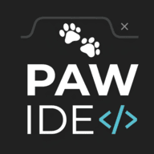

<div align="center">
  
  <h1>PawIDE</h1>
  <p><strong>A progressive, web-based HTML/CSS/JS compiler built by PawDevs.</strong></p>
  
  [](https://opensource.org/licenses/MIT)
  [](#)
  [](#)
</div>

<br/>

## 🚀 Overview

PawIDE is a lightning-fast, Single Page Application (SPA) compiler that brings a desktop-class coding experience to your browser. Featuring a VS Code-inspired UI, live preview, and integrated console, PawIDE is fully mobile-responsive and PWA-ready—meaning you can install it directly to your device and code offline.

## ✨ Features

* **Monaco Editor Integration:** Enjoy the same syntax highlighting, minimap, and smooth cursor animations as VS Code.
* **Progressive Web App (PWA):** Install PawIDE on your desktop or mobile device for native-like performance and offline capabilities.
* **Real-time Live Preview:** Instantly see your HTML, CSS, and JS changes rendered alongside your code.
* **Integrated Console:** A custom virtual console captures and displays your JS logs, warnings, and errors inside the preview.
* **Frictionless Sharing:** Export your entire workspace to a JSON file or generate a shareable URL to collaborate instantly.
* **Mobile Optimized:** A tailored UI that fluidly adapts from ultra-wide monitors down to portrait smartphone screens.

## 🛠️ Tech Stack

* **HTML5, CSS3, Vanilla JavaScript (ES6+)**
* **Monaco Editor** (Core editor engine)
* **Service Workers & Web App Manifest** (PWA features)

## 📦 Installation & Setup

PawIDE is a static application. No complex build tools or Node.js backends are required.

1. **Clone the repository:**
   ```bash
   git clone [https://github.com/pawjects/PawIDE.git](https://github.com/pawjects/PawIDE.git)
